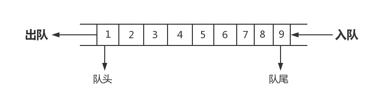

## Python数据结构-Queue(队列)
#python #数据结构

> 队列（queue），是先进先出（FIFO, First-In-First-Out）的线性表，在具体应用中通常用链表或者数组来实现，队列只允许在后端（称为 rear ）进行插入操作，在前端（称为 front ）进行删除操作，队列的操作方式和堆栈类似，唯一的区别在于队列只允许新数据在后端进行添加。[来自维基百科](https://zh.wikipedia.org/wiki/%E9%98%9F%E5%88%97)



抽象数据描述如下：
ADT Queue:
	Queue(self)			# 创建空队列
	is_empty(self)		# 判断队列是否为空
	enqueue(self, elem)	# 将元素elem加入队列
	dequeue(self)		# 删除队列中最先加入的元素并将其返回
	peek(self)			# 取得队列中最早进入的元素，不删除

由于通过顺序表来实现队列存在假性溢出或者O(n)操作，所以这里实现通过循环表实现：

```python
# -*- coding: UTF-8 -*- 


class QueueUnderflow(ValueError):
    pass


# 循环顺序表实现队列,头部删除和查看O(1),尾部加入O(1)
class SQueue(object):
    def __init__(self, init_num=8):
        self._len = init_num    # 存储区长度
        self._elems = [0] * init_num
        self._head = 0          # 表头元素下标
        self._num = 0           # 元素个数

    def is_empty(self):
        return self._num == 0

    def peek(self):
        if self.is_empty():
            raise QueueUnderflow
        return self._elems[self._head]

    def dequeue(self):
        if self.is_empty():
            raise QueueUnderflow
        result = self._elems[self._head]
        self._head = (self._head + 1) % self._len
        self._num -= 1
        return result

    def enqueue(self, elem):
        if self._num == self._len:
            self.__extand()
        self._elems[(self._head + self._num) % self._len] = elem
        self._num += 1

    def __extand(self):     # 当入队的时候如果 list长度不够，动态增加2倍
        old_len = self._len
        self._len *= 2
        new_elems = [0] * self._len
        for i in range(old_len):
            new_elems[i] = self._elems[(self._head + i) % old_len]
        self._elems, self._head = new_elems, 0


if __name__ == "__main__":
    q = SQueue()
    for i in range(8):
        q.enqueue(i)
    # for i in range(8):
    #    print(q.dequeue())
    # print(q._num)
    q.enqueue(3)
    print(q._num)

```

