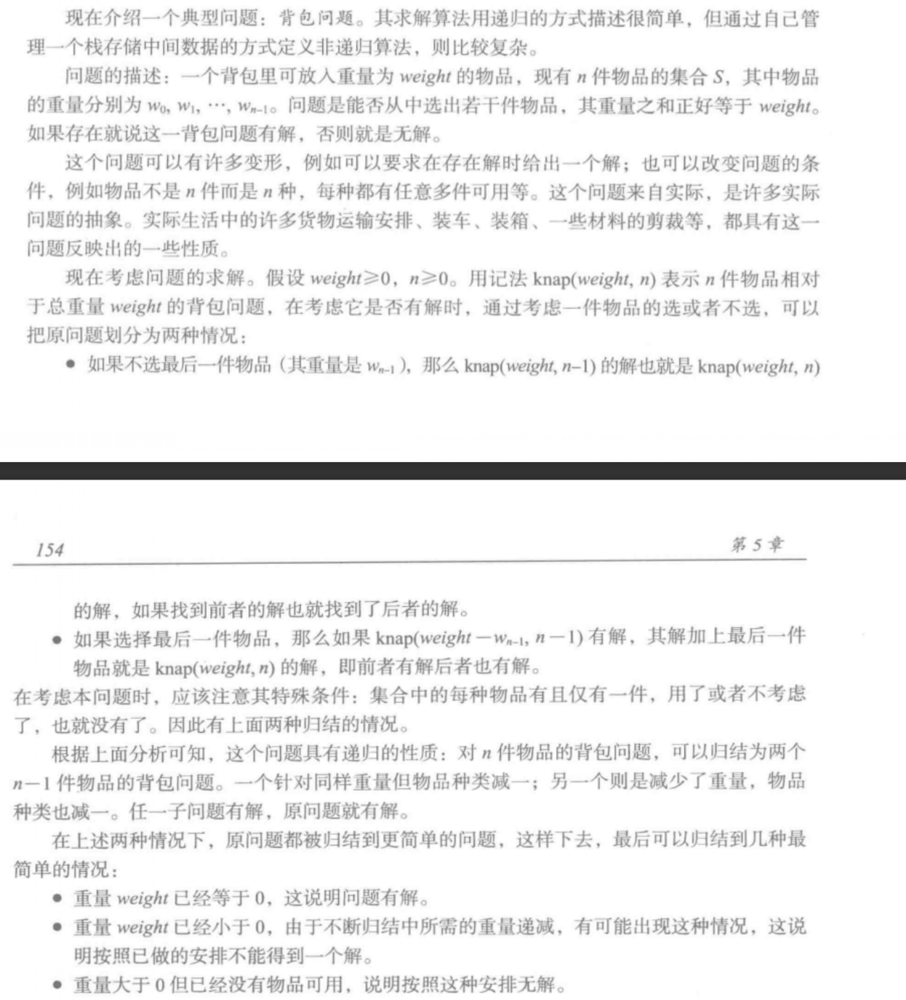

## Python数据结构-stack(堆栈)
#python #数据结构
> 堆栈（英语：stack）又称为栈或堆叠，是计算机科学中一种特殊的串列形式的抽象数据类型，其特殊之处在于只能允许在链表或数组的一端进行加入数据（英语：push）和输出数据（英语：pop）的运算。由于堆栈数据结构只允许在一端进行操作，因而按照后进先出（LIFO, Last In First Out）的原理运作。 [来自维基百科](https://zh.wikipedia.org/wiki/%E5%A0%86%E6%A0%88)

抽象数据描述如下：
ADT Stack:
	Stack(self)		# 创建空栈
	is_empty(self)	# 判断栈是否为空
	push(self, elem)	# 将元素elem加入栈
	pop(self)		# 删除栈中最后加入的元素并将其返回
	top(self)			# 取得栈中最后压入的元素，不删除

> 栈大多的实现是采用线性表

### 顺序表栈实现
1. 定义一个异常类

```python
class StackUnderflow(ValueError): # 栈下溢(空栈访问)
    pass
```

2. `Python` 的 list 是线性表的一种实现，在此使用 list 作为栈元素存储区，整体实现如下：

```python
class SStack:
    def __init__(self):
        self._elems = [] # 使用list存储栈元素

    def is_empty(self):
        return self._elems == []

    def push(self, elem):
        self._elems.append(elem)

    def pop(self):
        if self._elems == []:
            raise StackUnderflow("in SStack.pop()")
        return self._elems.pop()

    def top(self):
        if self._elems == []:
            raise StackUnderflow("in SStack.top()")
        return self._elems[-1]

```

3. 简单的书写测试用例

```python

if __name__ == '__main__':
    s = SStack()
    assert s.is_empty() is True
    try:
        s.pop()
    except StackUnderflow:
        print("StackUnderflow")
    s.push(123)
    assert s.is_empty() is not True
    assert s.pop() == 123

```

### 简单应用：括号匹配问题

> 给定一个字符串，其中的字符只包含三种括号：花括号*{ }*、中括号*[ ]*、圆括号*( )*，即它仅由*( ) [ ] { }*这六个字符组成。
> 设计算法，判断该字符串是否有效，即字符串中括号是否匹配。括号匹配要求括号必须以正确的顺序配对，如*{ [ ] ( ) }*或*[ ( { } [ ] ) ]*等为正确的格式，而*[ ( ] )*或*{ [ ( ) }*或*( { } ] )*均为不正确的格式。


**完整的括号匹配算法流程如下：**
1. 从前向后扫描字符串，遇到无关字符则跳过；
2. 遇到左括号 x，就把 x 压栈；
3. 遇到右括号 y:
    * 如果发现栈顶元素x和该括号y匹配，则栈顶元素出栈，继续判断下一个字符；
    * 如果栈顶元素x和该括号y不匹配，字符串不匹配；
    * 如果栈为空，字符串不匹配；
4. 扫描完成后，如果栈恰好为空，则字符串匹配，否则，字符串不匹配。

代码如下：

```python

def check_parens(text):
    stack = SStack()
    left_parens = "([{"
    right_parens = ")]}"
    parens = {")":"(", "]":"[", "}":"{"}
    for i in text:
        if i in left_parens:
            stack.push(i)
        elif i in right_parens:
            if stack.is_empty():
                return False
            if parens[i] != stack.pop():
                return False
    if stack.is_empty():
        return True
    return False

if __name__ == '__main__':
    assert check_parens("[{1232}]") is True
    assert check_parens("[{[}]") is False
    assert check_parens("[{123444]}]") is False
    assert check_parens("][{}]") is False

```


### 栈与函数调用经典问题之简单背包问题



递归实现如下：

```
# 简单背包问题
def knap_rec(weight, wlist, n):
    if weight == 0:
        return True
    if weight < 0 or (weight > 0 and n < 1):
        return False
    if knap_rec(weight - wlist[n-1], wlist, n-1):
        return True
    if knap_rec(weight, wlist, n-1):
        return True
    else:
        return False

```


